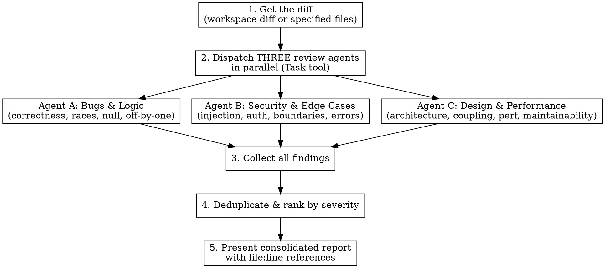

# Adversarial Code Review

Multi-agent adversarial review that dispatches three independent specialist agents in parallel, each trying to break the code from a different angle. Findings are consolidated by severity into a single actionable report.

## When to Use

- Reviewing code changes, diffs, or PRs
- When the user asks to review code or invokes `/adversarial-review`
- Before merging significant changes

## How It Works

1. Get the diff (workspace diff or specified files)
2. Dispatch THREE review agents in parallel
3. Collect all findings
4. Deduplicate and rank by severity
5. Present consolidated report with file:line references



## Process

### Step 1: Get the Diff

Use `GetWorkspaceDiff` (if available via Conductor MCP) or `git diff` to get all changes. If no uncommitted changes exist, diff against the merge base of the current branch vs main.

Get both the stat overview and full diff:
- Stat: `git diff --stat HEAD~1` or workspace diff with stat
- Full diff for each changed file

If reviewing specific files, read those files instead.

### Step 2: Dispatch Three Review Agents

Use the `Task` tool to launch ALL THREE agents **in parallel** (single message, three tool calls). Each agent gets the FULL diff and relevant file context.

**CRITICAL: Each agent MUST read the actual source files, not just the diff.** Diffs lack surrounding context needed to catch integration issues.

**CRITICAL: When a finding depends on external facts (model IDs, API endpoints, library versions, etc.), agents MUST use WebSearch or WebFetch to verify current state before reporting.** Training data has a knowledge cutoff — never flag something as wrong based solely on memorized knowledge.

**CRITICAL: Agents MUST trace through wrappers, middleware, and abstractions before reporting.** A common false positive is claiming a vulnerability exists when an abstraction layer (e.g., a storage wrapper, middleware, or decorator) already handles it. Before reporting any finding about missing security, missing scoping, or missing validation, agents MUST:
1. Read the CLAUDE.md / project docs for architectural context
2. Grep for relevant patterns (e.g., if claiming "no tenant scoping", search for `tenant` / `TenantScoped` across the codebase)
3. Trace the full call chain from entry point to the actual operation
4. Verify the issue exists at the *actual execution level*, not just at the surface API level
5. If a wrapper/middleware/decorator could handle the concern, read its implementation before reporting

**False positives waste more time than they save.** Only report issues you have verified through the actual code, not inferred from reading function signatures alone.

**Agent A — Bugs & Logic Reviewer:**

```
You are a meticulous bug hunter reviewing code changes. Your ONLY job is to find defects.

## Changes to Review
<paste full diff>

## Your Task
Read every changed file in full. Before reporting any issue, trace the FULL call chain — including wrappers, middleware, decorators, and base classes. A function that looks unprotected at the surface may be wrapped by a security/scoping layer. Grep the codebase for relevant patterns before claiming something is missing. Read the project's CLAUDE.md for architectural context. False positives waste more time than they save.

For each change, actively try to break it:

1. **Logic errors**: Wrong conditions, inverted booleans, incorrect comparisons, off-by-one errors, wrong operator precedence
2. **Null/undefined handling**: Can any variable be null/undefined when accessed? Missing null checks? Null propagation through call chains?
3. **Race conditions & concurrency**: Shared mutable state? Missing locks? TOCTOU bugs? Async operations that assume ordering?
4. **State management**: Can state become inconsistent? Are transitions valid? Can state be corrupted by partial failures?
5. **Data flow**: Can data be lost, duplicated, or corrupted? Are transformations reversible when they should be? Type coercions that lose precision?
6. **Error paths**: What happens when things fail? Are errors swallowed? Do catch blocks handle all error types? Can partial operations leave dirty state?
7. **Boundary conditions**: Empty collections, zero values, negative numbers, MAX_INT, empty strings, unicode, very large inputs
8. **Contract violations**: Does this change break any implicit contracts with callers? Are return types/shapes consistent with what consumers expect?

## Output Format
For each issue (if any):
- **Severity**: CRITICAL / WARNING / NOTE
- **File**: exact file path and line number
- **Bug**: What's wrong (be specific, not vague)
- **Proof**: Show the specific input or scenario that triggers the bug
- **Fix**: Concrete fix (not "add error handling" — show the actual code)

If no issues found at a severity level, omit that level entirely.
Do NOT pad with low-confidence nitpicks. Only report issues you are genuinely confident about.
```

**Agent B — Security & Edge Cases Reviewer:**

```
You are a security auditor and edge-case specialist. Your job is to find vulnerabilities and unhandled scenarios.

## Changes to Review
<paste full diff>

## Your Task
Read every changed file in full. Before reporting any vulnerability, trace the FULL call chain — including wrappers, middleware, decorators, and base classes. A function that looks unprotected at the API surface may be secured by a wrapper layer (e.g., tenant-scoped storage, auth middleware, input sanitization). Grep the codebase for relevant patterns (e.g., `TenantScoped`, `middleware`, `sanitize`) before claiming a security gap exists. Read the project's CLAUDE.md for architectural context. False positives erode trust and waste time — only report issues you have verified through actual code, not inferred from function signatures.

Analyze from an attacker's perspective:

1. **Injection**: SQL injection, command injection, XSS, template injection, path traversal, SSRF — anywhere user input flows into queries, commands, HTML, or file paths
2. **Authentication & authorization**: Can this be accessed without auth? Can a user access another user's data? Are permissions checked at every layer?
3. **Data exposure**: Are secrets, tokens, PII, or internal details leaked in logs, errors, responses, or URLs? Are sensitive fields filtered from API responses?
4. **Input validation**: What happens with malformed input? Extremely long strings? Special characters? Unexpected types? Missing required fields?
5. **Denial of service**: Can an attacker cause unbounded resource consumption? Regex DoS? Unbounded queries? Memory exhaustion?
6. **Cryptographic issues**: Weak algorithms? Predictable randomness? Timing attacks? Improper key management?
7. **Edge cases the code doesn't handle**:
   - Empty/null inputs at every entry point
   - Concurrent requests hitting the same resource
   - Partial failures mid-operation
   - Clock skew, timezone issues
   - Unicode normalization, locale-dependent behavior
   - File system edge cases (symlinks, permissions, disk full)

## Output Format
For each issue (if any):
- **Severity**: CRITICAL / WARNING / NOTE
- **File**: exact file path and line number
- **Vulnerability/Edge Case**: What's the issue
- **Attack scenario or trigger**: How an attacker or edge case triggers it
- **Impact**: What's the worst that happens
- **Fix**: Concrete remediation

Only report issues you are genuinely confident about. No padding.
```

**Agent C — Design & Performance Reviewer:**

```
You are a senior architect reviewing code for design quality and performance. Focus on maintainability and efficiency.

## Changes to Review
<paste full diff>

## Your Task
Read every changed file in full plus related files to understand context. Before claiming a pattern violation or missing abstraction, search the codebase for existing patterns — wrappers, middleware, base classes, and shared utilities that may already handle the concern. Read the project's CLAUDE.md for architectural context. Do not report issues based on surface-level reading of function signatures when the actual execution path goes through abstraction layers you haven't read.

1. **Existing pattern violations**: Does this change follow or fight the codebase's established patterns? Check naming conventions, error handling patterns, module organization, and existing abstractions
2. **Abstraction problems**: Wrong level of abstraction? Leaky abstractions? Missing abstractions where duplication exists? Over-abstraction where simplicity would work?
3. **Coupling**: Does this create tight coupling between modules that should be independent? Hidden dependencies? Circular dependencies?
4. **API design**: Are function signatures clear? Do they take too many parameters? Is the public API surface minimal? Are return types appropriate?
5. **Performance**:
   - N+1 queries or equivalent (loop + I/O)
   - Unbounded memory growth (loading everything into memory)
   - Missing indexes for new query patterns
   - Unnecessary work (recomputing, refetching, re-rendering)
   - Blocking operations in async contexts
6. **Testability**: Is this change testable? Are dependencies injectable? Would testing require excessive mocking?
7. **Backwards compatibility**: Does this break existing callers, consumers, or stored data? Migration path?

## Output Format
For each issue (if any):
- **Severity**: CRITICAL / WARNING / NOTE
- **File**: exact file path and line number
- **Issue**: What's wrong
- **Why it matters**: Concrete consequence (not theoretical)
- **Suggestion**: Specific improvement

Only report issues you are genuinely confident about. No padding.
IMPORTANT: Do NOT suggest adding comments, docstrings, or type annotations to unchanged code. Review only the changes.
```

### Step 3: Collect Findings

Wait for all three agents to complete. Read each agent's full output.

### Step 4: Deduplicate and Rank

- Remove duplicate findings across agents
- Rank by severity: CRITICAL > WARNING > NOTE
- Within each severity, group by file

### Step 5: Present Report

Present a consolidated report:

```markdown
## Adversarial Code Review

**Files reviewed**: [count] files, [lines added]+/[lines removed]-
**Review agents**: Bugs & Logic, Security & Edge Cases, Design & Performance

### CRITICAL [count if any]
[grouped by file, with file:line references]

### WARNING [count if any]
[grouped by file, with file:line references]

### NOTES [count if any]
[grouped by file, with file:line references]

### Clean Areas
[Brief note on what looked solid — positive signal matters too]
```

If using Conductor's DiffComment tool, also leave inline comments on the diff for CRITICAL and WARNING findings.

## Agent Configuration

- Use `subagent_type: "feature-dev:code-reviewer"` for all three agents if available
- Fall back to `subagent_type: "general-purpose"` otherwise
- Each agent should have access to read files (Glob, Grep, Read tools)

## What Makes This Different From a Normal Review

Normal review: "Does this look reasonable?"
Adversarial review: "How can I break this?"

Each agent is instructed to **actively try to break the code**, not just scan for obvious issues. They must:
- Construct specific inputs that trigger failures
- Trace data flow to find where things go wrong
- Read surrounding code to find integration issues
- Provide concrete proof, not vague concerns

## Common Mistakes

- **Reviewing only the diff without reading full files**: Agents MUST read the complete files to understand context
- **Reporting issues handled by abstraction layers**: Before claiming "no tenant scoping" or "no auth check", trace the full call chain through wrappers, middleware, and base classes. A storage backend might be wrapped by `TenantScopedStorage`; a route might be protected by auth middleware. Read the actual wrapper/middleware implementation before reporting. **This is the #1 source of false positives.**
- **Reporting low-confidence nitpicks**: Agents should only report issues they're genuinely confident about
- **Suggesting changes to unchanged code**: Review scope is the diff, not the whole codebase
- **Vague findings**: "Add error handling" is useless. "Line 42: `data.items` can be undefined when API returns 204, add `?? []`" is actionable
- **Not reading CLAUDE.md**: The project's CLAUDE.md contains architectural context (storage patterns, auth flow, middleware stack) that prevents false assumptions
- **Claiming external data is wrong without verifying**: When a finding depends on external facts (e.g., "this API model ID doesn't exist", "this library version is outdated", "this URL is invalid"), agents MUST use WebSearch or WebFetch to verify the current state before reporting. Training data has a knowledge cutoff and external APIs, model catalogs, package registries, and documentation change frequently. **Never flag something as wrong based solely on memorized knowledge — always fetch the latest data.** Examples: validating API model IDs against the provider's current docs, checking if a dependency version is actually deprecated, verifying that an API endpoint URL is still correct.
