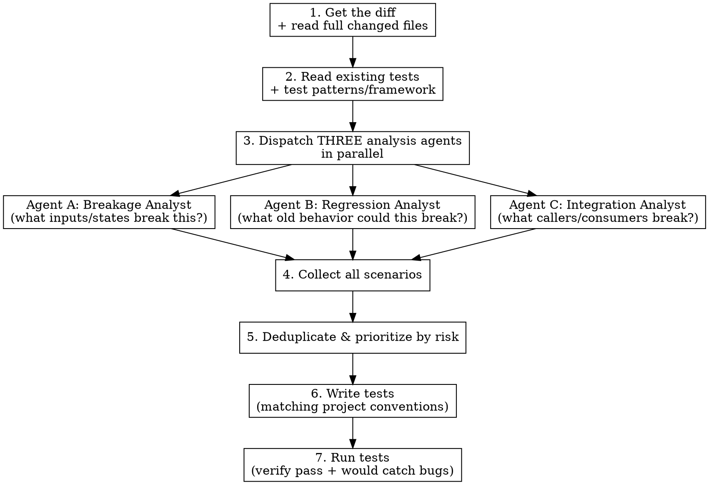

# QA Test Writer

Analyzes code changes from an attacker/breaker mindset, identifies every way the code can fail, regress, or misbehave, then writes targeted tests for each scenario. Focuses on tests that catch real bugs — not coverage padding.

## When to Use

- When the user invokes `/qa-test-writer`
- After implementing a feature or bug fix, to write tests that actually protect against regressions
- When the user asks to "write tests", "add test coverage", or "QA this"

## Philosophy

```
Tests exist to CATCH BUGS, not to increase coverage numbers.

A test that passes on broken code is worse than no test at all.
```

**What this skill does NOT do:**
- Write tests that just assert the current behavior is the current behavior
- Add trivial getter/setter tests
- Test framework internals or third-party library behavior
- Pad coverage with tests that can never fail

**What this skill DOES:**
- Identify the exact ways code can break
- Write tests for boundary conditions, error paths, race conditions, and state corruption
- Create regression tests for specific bug scenarios
- Test the contract between components, not implementation details

## How It Works

1. Get the diff and understand what changed
2. Dispatch THREE analysis agents in parallel
3. Collect all breakage scenarios
4. Deduplicate and prioritize by risk
5. Write tests for every real scenario
6. Run tests to verify they pass (and would fail if the bug existed)



## Process

### Step 1: Get the Diff

Use `GetWorkspaceDiff` (if available via Conductor MCP) or `git diff` to get all changes. If no uncommitted changes exist, diff against the merge base of the current branch vs main.

Read the **full source files** for every changed file — diffs alone miss critical context like surrounding logic, invariants, and caller expectations.

### Step 2: Discover Test Conventions

Before writing any tests, understand the project's test setup:

1. **Find existing test files**: Glob for `**/Tests/**`, `**/*.test.*`, `**/*_test.*`, `**/*Test.*`, `**/*.spec.*`
2. **Read 2-3 existing test files** to learn:
   - Test framework (XCTest, Jest, pytest, Go testing, etc.)
   - Naming conventions (`test_snake_case`, `testCamelCase`, `it('should ...')`)
   - Setup/teardown patterns (fixtures, mocks, factories)
   - Assertion style (`XCTAssertEqual`, `expect().toBe()`, `assert`)
   - File organization (one test file per source file? grouped by feature?)
   - Mock patterns (protocol-based mocks, dependency injection, test doubles)
3. **Read CLAUDE.md** for any test-specific instructions (required commands, prerequisites, conventions)
4. **Check for test helpers/utilities** already in the project

**CRITICAL: Match the project's existing test patterns exactly.** Do not introduce a new test framework, assertion library, or organizational style.

### Step 3: Dispatch Three Analysis Agents

Use the `Agent` tool to launch ALL THREE agents **in parallel** (single message, three tool calls). Each agent gets the full diff, the changed source files, and the existing test context.

**Agent A — Breakage Analyst:**

```
You are a QA engineer whose job is to BREAK this code. You think like a fuzzer.

## Changes to Analyze
<paste full diff + changed file contents>

## Existing Test Files
<paste list of existing test files>

## Your Task
Read every changed file in full. For each change, systematically identify inputs, states, and conditions that would cause incorrect behavior:

1. **Boundary values**: Zero, negative, empty, nil/null, MAX_INT, empty string, single character, very long strings, unicode edge cases, NaN, infinity
2. **Invalid inputs**: Wrong types (if dynamic), malformed data, missing required fields, extra unexpected fields, inputs that violate undocumented assumptions
3. **State-dependent failures**: What if this runs when the system is in an unexpected state? Uninitialized, partially initialized, mid-cleanup, after error, during shutdown
4. **Concurrency**: What if two calls happen simultaneously? What if the order of async operations changes? What if a callback fires after cleanup?
5. **Resource exhaustion**: What if memory is low, disk is full, network times out, a file handle is invalid?
6. **Arithmetic edge cases**: Integer overflow, floating point precision loss, division by zero, negative modulo
7. **Collection edge cases**: Empty collection, single element, duplicate elements, unsorted when sorted expected, very large collection

## Output Format
For each scenario:
- **Risk**: HIGH / MEDIUM / LOW
- **Component**: Which function/method/class
- **Scenario**: Precise description of what breaks
- **Input/State**: Exact input values or state that triggers the break
- **Expected failure mode**: What goes wrong (crash, wrong result, data corruption, silent error)
- **Test sketch**: 2-3 line pseudocode showing the test assertion

Only report scenarios that are REALISTIC — not theoretical impossibilities. If the language/framework prevents a scenario (e.g., type system prevents wrong-type input), skip it.
```

**Agent B — Regression Analyst:**

```
You are a regression testing specialist. Your job is to ensure the changes don't break EXISTING behavior.

## Changes to Analyze
<paste full diff + changed file contents>

## Existing Tests
<paste existing test file contents for changed modules>

## Your Task
Read every changed file in full, plus the existing tests. Identify:

1. **Changed behavior**: What did this code do BEFORE the change? What does it do AFTER? For every behavioral difference, there should be a test that validates the new behavior AND doesn't break the old contract.
2. **Removed/weakened guards**: Were any validation checks, error handlers, or safety guards removed or relaxed? These need regression tests to ensure the removal was intentional and safe.
3. **Modified control flow**: Did if/else branches change? Did loop conditions change? Did early returns move? Each path change is a regression risk.
4. **API contract changes**: Did function signatures, return types, error types, or side effects change? Every caller needs to still work correctly.
5. **Data format changes**: Did serialization, storage format, or wire format change? Existing persisted data must still load correctly.
6. **Default value changes**: Did any defaults change? Code relying on the old default may break silently.
7. **Existing test gaps**: Are there existing behaviors with NO tests that this change could affect? These are the highest-risk regressions.

## Output Format
For each regression risk:
- **Risk**: HIGH / MEDIUM / LOW
- **Component**: Which function/method/class
- **Previous behavior**: What it did before
- **New behavior**: What it does now
- **Regression scenario**: How existing code/callers could break
- **Test sketch**: 2-3 line pseudocode showing the regression test

Focus on HIGH and MEDIUM risks. Skip trivial renames or formatting changes.
```

**Agent C — Integration Analyst:**

```
You are an integration testing specialist. Your job is to find how changes affect the SYSTEM as a whole.

## Changes to Analyze
<paste full diff + changed file contents>

## Your Task
Read every changed file in full. Then trace upstream and downstream:

1. **Find all callers**: Grep for every function/method that was changed. Read the callers. Can any caller pass inputs the new code doesn't handle? Does the new return value/error break any caller's assumptions?
2. **Find all consumers**: If the change affects data models, serialization, or stored data, find everything that reads this data. Will it handle the new format?
3. **Cross-component interactions**: Does this change affect timing, ordering, or lifecycle in ways that other components depend on? (e.g., changing when a notification fires, changing initialization order)
4. **Configuration dependencies**: Does this change depend on config, environment, or feature flags that could be in unexpected states?
5. **Pipeline/workflow breaks**: If this is part of a multi-step pipeline (e.g., record → transcribe → correct → inject), test the full pipeline with the changed component, not just the component in isolation.

## Output Format
For each integration risk:
- **Risk**: HIGH / MEDIUM / LOW
- **Upstream component**: What calls/feeds into the changed code
- **Downstream component**: What consumes the output
- **Integration scenario**: How the interaction breaks
- **Test sketch**: 2-3 line pseudocode showing the integration test

Only report scenarios where you've VERIFIED the caller/consumer exists by reading the actual code. Do not hypothesize about callers that don't exist.
```

### Step 4: Collect and Prioritize

Wait for all three agents. Consolidate findings:

1. **Deduplicate**: Remove scenarios reported by multiple agents
2. **Prioritize by risk**:
   - HIGH: Would cause crashes, data corruption, or silently wrong results in production
   - MEDIUM: Edge cases that affect correctness under specific conditions
   - LOW: Minor behavioral differences, cosmetic issues
3. **Filter out already-covered scenarios**: If an existing test already covers a scenario, skip it
4. **Filter out impossible scenarios**: Remove scenarios the language/framework prevents

### Step 5: Write Tests

Write tests for ALL HIGH and MEDIUM scenarios, and selected LOW scenarios that are easy to test.

**CRITICAL RULES:**

1. **Match project conventions exactly** — same framework, naming, file organization, assertion style
2. **One test per scenario** — each test should test exactly ONE breakage scenario with a descriptive name
3. **Test names describe the scenario, not the method** — `testTranscriptionTimeoutReturnsEmptyAndResetsState` not `testTranscribe`
4. **Arrange-Act-Assert** — clear setup, single action, specific assertions
5. **Test the behavior, not the implementation** — assert on outputs and side effects, not on internal state (unless internal state IS the contract)
6. **Include the "would fail" reasoning** — add a brief comment explaining what bug this test catches
7. **No mocking unless necessary** — prefer real objects. Only mock external I/O, timers, and system APIs. If the project has established mock patterns, use those.
8. **Test error paths explicitly** — don't just test the happy path. Most bugs live in error handling.
9. **Add tests to existing test files when appropriate** — don't create a new file if there's already a test file for the component

**Test quality checklist (verify each test against this):**
- [ ] Would this test FAIL if the bug it targets were introduced?
- [ ] Does this test have exactly ONE reason to fail?
- [ ] Is the test name specific enough to diagnose what broke without reading the test body?
- [ ] Are assertions specific (exact values, not just "not nil")?
- [ ] Does the test clean up after itself?

### Step 6: Run Tests

After writing all tests:

1. **Run the full test suite** using the project's test command (check CLAUDE.md for instructions)
2. **All new tests must pass** — if a test fails, it means either:
   - The test is wrong → fix the test
   - The code has a real bug → report to the user, don't "fix" the test to pass on broken code
3. **Verify tests are meaningful** — mentally trace: if I reverted the code change, would this test catch it?

If there are prerequisites to running tests (building dependencies, database setup, etc.), handle those first.

## Output Format

After writing and running tests, present a summary:

```markdown
## QA Test Report

**Changes analyzed**: [brief description of what changed]
**Scenarios identified**: [count] (H: [n] / M: [n] / L: [n])
**Tests written**: [count] across [n] files
**Test run**: [PASS/FAIL with details]

### Test Scenarios Covered

#### HIGH Risk
- `testName` — [what it catches] (file:line)
- ...

#### MEDIUM Risk
- `testName` — [what it catches] (file:line)
- ...

### Scenarios Intentionally Skipped
- [scenario] — [why skipped: already covered / impossible / too low value]

### Potential Issues Found
- [any bugs discovered during analysis that aren't just test scenarios]
```

## Agent Configuration

- Use `subagent_type: "feature-dev:code-reviewer"` for all three agents if available
- Fall back to `subagent_type: "general-purpose"` otherwise
- Each agent needs read access to the full codebase (Glob, Grep, Read tools)

## Common Mistakes

- **Writing tests that just call the function and assert it doesn't crash**: This catches almost nothing. Assert on specific return values, state changes, and side effects.
- **Testing only the happy path**: The happy path is the LEAST likely place for bugs. Test error paths, boundary conditions, and invalid inputs.
- **Mocking too much**: If you mock the thing you're testing, the test is worthless. Only mock external dependencies.
- **Not reading existing tests first**: You'll duplicate coverage, use wrong conventions, or miss test helpers that already exist.
- **Writing tests that are coupled to implementation**: If a refactor (same behavior, different code) breaks the test, the test is testing implementation, not behavior.
- **Huge test methods testing multiple things**: Each test should have ONE reason to fail. Split multi-scenario tests into focused individual tests.
- **Not running the tests**: Writing tests that don't compile or don't pass is worse than writing no tests. Always run them.
- **Asserting on stringified output or snapshots when structured assertions are possible**: `XCTAssertEqual(result.count, 3)` is better than `XCTAssertEqual(result.description, "[1, 2, 3]")`.
- **Ignoring the project's CLAUDE.md**: It often contains test prerequisites, commands, and patterns you must follow.
