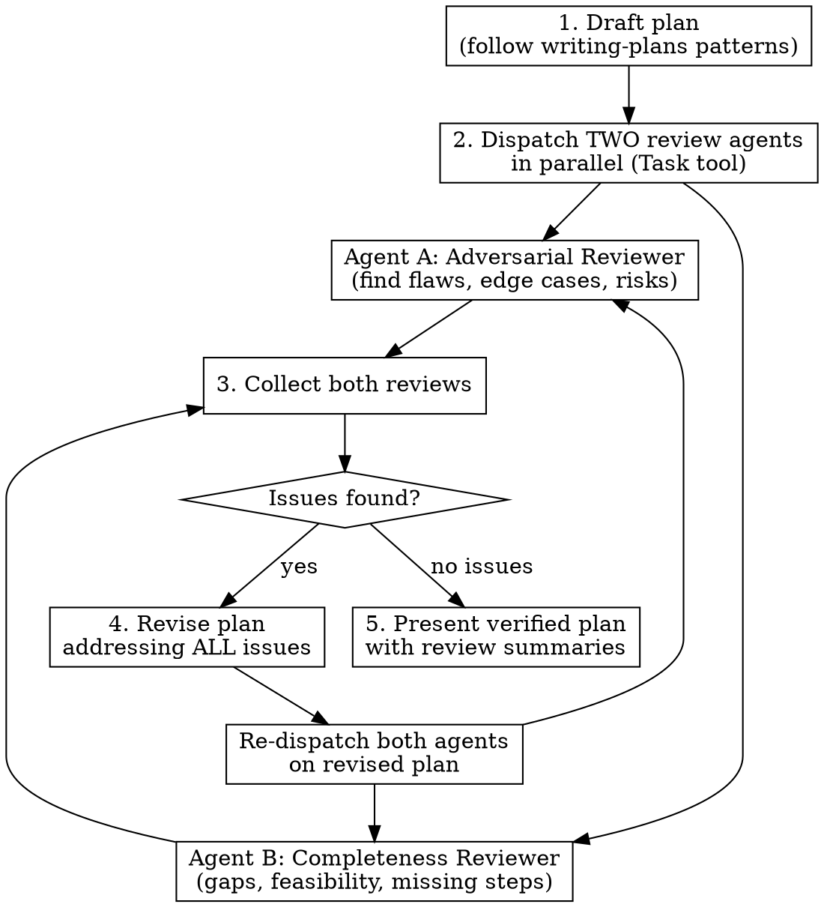

# Verified Planning

Every plan gets adversarially reviewed by two independent agents before the user sees it. No plan is presented without passing dual verification.

## When to Use

- ANY time you would use `writing-plans` — use this skill INSTEAD
- Before ANY call to `ExitPlanMode`
- When brainstorming transitions to planning

## The Iron Rule

```
NO PLAN REACHES THE USER WITHOUT DUAL AGENT VERIFICATION.
```

**No exceptions:**
- Not for "simple plans"
- Not for "obvious implementations"
- Not for "just a small change"
- Not when you're "confident it's right"

## How It Works

1. Draft the plan following writing-plans patterns
2. Dispatch TWO review agents in parallel
3. Collect both reviews and assess
4. Revise if needed (max 2 rounds)
5. Present verified plan with review summaries



## Process

### Step 1: Draft the Plan

Follow `writing-plans` patterns: exact file paths, bite-sized tasks, TDD steps, verification commands. Save draft to `docs/plans/YYYY-MM-DD-<feature>-draft.md`.

### Step 2: Dispatch Two Independent Review Agents

Use the `Task` tool to launch BOTH agents **in parallel** (single message, two tool calls). Each agent gets the FULL plan text and the relevant codebase context.

**Agent A — Adversarial Reviewer:**

```
You are an adversarial plan reviewer. Your job is to FIND PROBLEMS, not validate.

## Plan to Review
<paste full plan>

## Your Task
Review this implementation plan and identify:

1. **Logic flaws**: Will this approach actually work? Are there race conditions,
   ordering issues, or incorrect assumptions?
2. **Edge cases missed**: What inputs, states, or scenarios does the plan not handle?
3. **Architectural risks**: Does this fight the existing codebase patterns?
   Will it create tech debt? Does it break existing functionality?
4. **Security concerns**: Any injection vectors, auth bypasses, data leaks?
5. **Missing error handling**: What fails silently? What throws unhandled?
6. **Wrong abstractions**: Is this over-engineered? Under-engineered?
   Would a simpler approach work?

Read the relevant source files in the codebase to verify assumptions the plan makes.

## Output Format
For each issue found:
- **Severity**: CRITICAL / WARNING / NOTE
- **Location**: Which plan step or file
- **Issue**: What's wrong
- **Suggestion**: How to fix it

If no issues found, explicitly state "No issues found" with brief reasoning
for why the plan is sound.
```

**Agent B — Completeness Reviewer:**

```
You are a completeness and feasibility reviewer. Your job is to find GAPS
and verify the plan is IMPLEMENTABLE as written.

## Plan to Review
<paste full plan>

## Your Task
Review this implementation plan and verify:

1. **File accuracy**: Do all referenced files exist? Are the paths correct?
   Are the functions/classes/methods the plan references actually there?
2. **Missing steps**: Can a developer follow this step-by-step without guessing?
   Are there implicit steps not documented?
3. **Dependency order**: Are tasks ordered correctly? Does task N depend on
   something from task M that comes later?
4. **Test coverage**: Does every behavioral change have a corresponding test?
   Are the test assertions specific enough?
5. **Integration gaps**: How do the pieces connect? Is the wiring documented?
6. **Rollback safety**: If something fails mid-implementation, can we recover?
7. **Missing migrations/config**: Database changes, env vars, config updates
   that the plan assumes but doesn't document?

Read the relevant source files in the codebase to verify the plan matches reality.

## Output Format
For each gap found:
- **Type**: MISSING_STEP / WRONG_ASSUMPTION / ORDERING / COVERAGE_GAP / INTEGRATION
- **Location**: Which plan step or file
- **Gap**: What's missing or wrong
- **What to add**: Specific addition or correction

If plan is complete, explicitly state "Plan is complete and implementable"
with brief reasoning.
```

### Step 3: Collect and Assess Reviews

Read both agent responses. Categorize issues:
- **CRITICAL**: Must fix before presenting (logic flaws, security, wrong assumptions)
- **WARNING**: Should fix (edge cases, missing steps)
- **NOTE**: Include as callouts in the plan

### Step 4: Revise if Needed

If any CRITICAL or WARNING issues exist:
1. Revise the plan addressing every issue
2. Re-dispatch BOTH agents on the revised plan (loop back to Step 2)
3. Maximum 2 revision rounds — if still failing, present with unresolved items flagged

### Step 5: Present to User

When both agents report clean (or max rounds reached):
1. Rename draft to final: `docs/plans/YYYY-MM-DD-<feature>.md`
2. Include a **Review Summary** section at the top of the plan:

```markdown
## Review Summary
**Adversarial Review**: Passed — [1-2 sentence summary]
**Completeness Review**: Passed — [1-2 sentence summary]
**Revision rounds**: N
**Unresolved notes**: [any NOTEs that don't block implementation]
```

3. THEN use `ExitPlanMode` to present to the user

## Red Flags — STOP

If you catch yourself thinking any of these, STOP:

| Thought | Reality |
|---------|---------|
| "This plan is simple enough to skip review" | Simple plans have simple bugs. Review. |
| "I'm confident in this plan" | Your confidence is not verification. Review. |
| "Review agents will just say it's fine" | Then it costs you 30 seconds. Review. |
| "This is taking too long" | Catching a flaw now saves hours later. Review. |
| "I'll just present it and iterate with the user" | The whole point is to NOT waste user time. Review. |
| "One review agent is enough" | Two perspectives catch different things. Both. Always. |

## Common Mistakes

- **Sending plan summary instead of full plan to agents**: Always send the COMPLETE plan text
- **Not giving agents codebase access**: Agents need to READ files to verify assumptions
- **Skipping re-review after revisions**: If you changed the plan, both agents review again
- **Hiding review results from user**: Always include the Review Summary section
